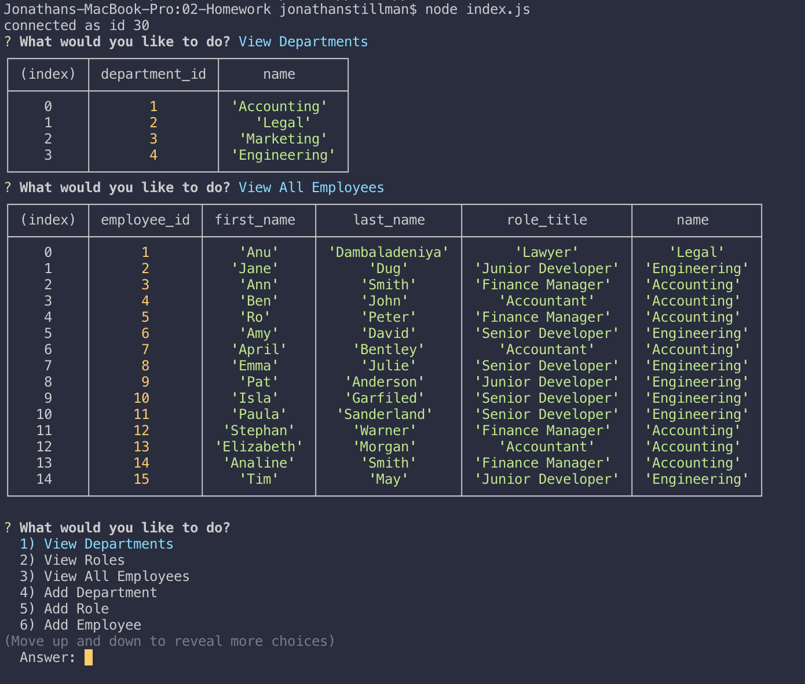

# Employee_Management

### Command Line Application for Employee Management System

This is a NodeJS CLI that helps track employees along with giving the user to view, add, delete, and update employees. They also have control over viewing, adding, and deleting roles they might have, and departments they might work in.

#### Technologies & Dependencies

Node.Js / NPM /Inquirer.Js / MySQL.Js

##### Application Demo as follows

